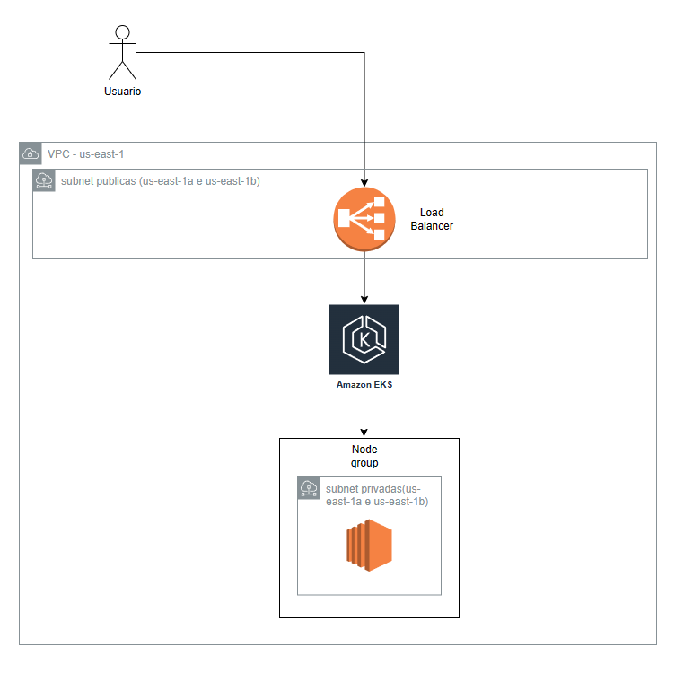
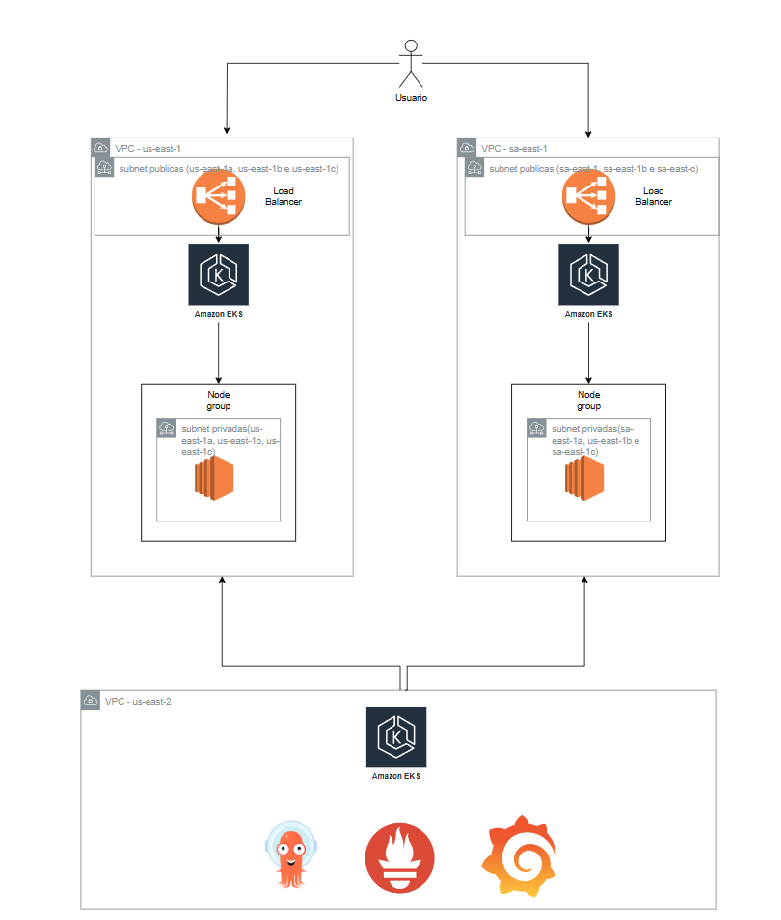

# Arquitetura infraestrutura desenvolvida

Simplifiquei o desenho da arquitetura com os principais recursos criados, no node group estão todos os recursos que serão implementados(API comentarios, hello-world, ArgoCD, Grafana e Prometheus).

# Arquitetura ideal

Neste formato, seria uma arquitetura multi-region com clusters EKS em cada região apenas com o workload de produção, e em uma terceira região apenas recursos internos de monitoramento/observabilidade/serviços internos.

Neste formato poderia funcionar tanto como ativo / ativo ou ativo / passivo. No caso de ativo / passivo, poderia omitir a terceira região, os serviços internos poderiam ficar na mesma região ativa, apenas em cluster separado(na minha visão).