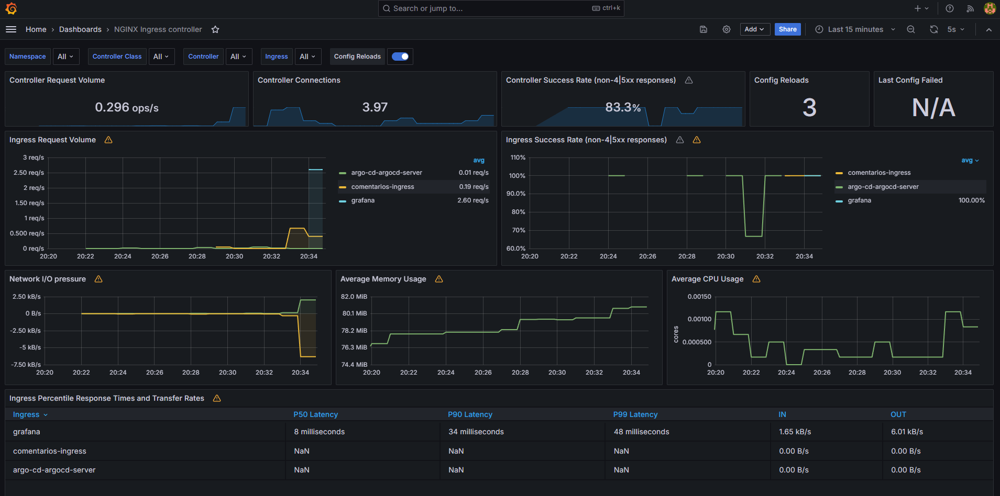

# Arquitetura

A ideia é propor uma arquitetura escalavel tanto de forma horizontal quanto vertical para publicar esta aplicação e futuras que poderiam vir a ser necessario ter um ambiente semelhante, nesta forma podemos reutilizar esta arquitetura para o deploy de novas apps. Mesmo que a aplicação de comentários em questão não seja escalavel(não possui persistencia de dados), preferi optar por uma arquitetura escalavel para simular um cenário real do dia-a-dia.

## Tecnologias

Para este desafio será utilizado como Cloud provider a AWS devido ao maior conhecimento que tenho.

Utilizarei Kubernetes para orquestração de containers e facilitação em criar uma arquitetura escalavel e de alta disponibilidade.

Fiz reflexões de formas para disponibilizar o k8s, entre fazer o deploy do cluster com RKE2 em instancias EC2 ou utilizar kubernetes gerenciado da AWS(EKS). Optei por utilizar kubernetes gerenciado da AWS(EKS) primeiramente devido a facilidade ao subir e nao precisar gerenciar os control plane, alem disto, por questões de custo eu não precisaria manter EC2 on-demand para executar control plane e workers. Com o EKS consigo utilizar instancias spot para suportar o workload.

Para fazer o deploy de infraestrutura de forma automatizada, será utilizado Terraform que é uma ferramenta opensource para provisionamento de infraestrutura, optei devido a facilidade de uso e documentação.

A ideia inicial do deploy de infraestrutura seria utilizar Atlantis para review do *plan* do terraform e apply em um pull request caso estivesse tudo correto, porém principalmente devido ao tempo restrito resolvi priorizar outras questões do desafio, então o deploy de infraestrutura é executado localmente, disponibilizei um Makefile com a opção de execução e algumas validações.

Para deploy de aplicações, optei por utilizar da estrategia de GitOps para tornar o ambiente o mais resiliente possivel e ter padronização nas configurações. Utilizei ArgoCD visando criar uma estrutura que seja expansivel para outras apps. A ideia inicial era utilizar helm charts para renderizar os templates e gerar os manifestos de acordo com os *values* passados para cada aplicação, porém acabou faltando tempo para execução desta etapa então optei por manifestos simples. Além disto, é utilizado Github Actions para build da imagem e push no repositório.

Como ferramenta de CI/CD optei por utilizar o Github Actions devido a feature de "functions" reutilizaveis que poderia me auxiliar na agilidade no desenvolvimento do projeto em alguns steps.

Optei para fazer a distribuição de carga e expor os serviços externamente utilizar nginx-ingress principalmente devido a facilidade no uso para otimização de tempo, em uma solução visando ambiente produtivo que requer features avançadas, poderia optar por kong Ingress ou Istio.

Para observabilidade, optei pela stack de Prometheus/Grafana que tenho maior familiariadade, configurei para capturar metricas do nginx e as internas do cluster.

A aplicação de comentarios está apenas com um pod para não gerar resultados inconsistentes nos endpoints de salvar e busca de comentarios.

Obs: Não utilizei ECR pois nos manifestos que ficam neste [repositório](https://github.com/Fsavila/desafio-apps) iria expor algumas informações como account_id, então por questão de segurança optei por utilizar um repositório publico no DockerHub, mas a logica segue a mesma, alem de evitar um custo desnecessario. :D

Obs²: Este [repositório](https://github.com/Fsavila/desafio-apps) contem apenas os manifestos das aplicações que serão realizadas o deploy no cluster, todo o código esta neste repo central. Optei por separar o repositório dos manifestos para o ArgoCD devido a complexidade que iria gerar caso eu colocasse em um diretório neste repo.

# Alterações

- Criei um simples endpoint de healthcheck na aplicação de comentarios para poder configurar liveness/readiness probe e possibilitar ter um monitoramento ativo de funcionamento do pod e restart caso necessário. Log do gunicorn com o request do healthcheck:

# Pontos de melhoria

- Acredito que em uma solução de dia-a-dia, poderia ter uma melhor organização do código terraform, como dividir por modulos(ex: Em um diretório gera tudo respectivo a rede: vpc, subnet, internet gateway, nat gateway, etc). Neste formato que fiz acabou ficando tudo no mesmo diretório, porém ao decorrer do tempo pode ficar confuso e de dificil gerenciamento.

- Trabalhando em time, o statefile do Terraform deve estar sendo armazenado em um storage externo como o S3, por exemplo.

- Neste caso, como lab, fiz deploy do ArgoCD, Prometheus e Grafana no mesmo cluster das aplicações, acredito que um ambiente produtivo não seja uma boa alternativa pois caso ocorra alguma indisponibilidade no cluster, os serviços de monitoramento e o de deploy ficariam indisponiveis, prejudicando analises e até soluções de disaster recovery. Optaria por disponibilizar estes serviços em um cluster separado ou uso de serviços gerenciados. Além disto, centralizei tudo em apenas um nginx-ingress com o LoadBalancer externo, o que poderia gerar uma vulnerabilidade de segurança ter o Prometheus exposto para qualquer um na internet consultar as metricas armazenadas. Como trata-se de um teste e não ter nenhum dado produtivo, não me preocupei com isto.(O Ambiente foi recriado diversas vezes).

- Configurei de forma automatica para subir o Prometheus e Grafana, com o grafana ja configurando o Datasource para o prometheus disponibilizado, apenas não configurei um import de dashboard automatico, mas pode ser feito pela interface de gerenciamento do software. Está sendo feito scrapes de métricas do nginx-ingress.

Exemplo:

- Não possuo um dominio registrado para ter configuração automatica de DNS, então o que fiz através do Makefile é quando fazer o deploy da infraestrutura, captar o IP externo do LoadBalancer provisionado para o nginx-ingress e criar uma entrada no /etc/hosts para testes, exemplo:

54.175.62.132 argocd.felipeavila.com.br hello-world.felipeavila.com.br comentarios.felipeavila.com.br grafana.felipeavila.com.br prometheus.felipeavila.com.br

Assim, conseguimos testar todas as ferramentas que foram instaladas.

Obs: O hello-world.felipeavila.com.br trata-se apenas de um deployment de um nginx para testar as regras do ingress e ver a distribuição para o serviço correto de acordo com a URL passada, além de demonstrar que esta arquitetura está projetada para suportar cenários de 0, 1 e X aplicações.
