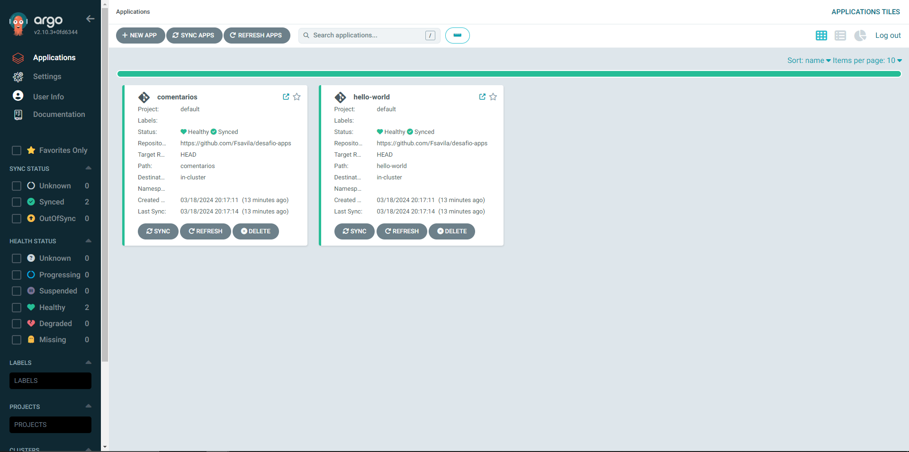

# Deploy

Para provisionamento dos recursos de infraestrutura, deve ser executado o código terraform disponivel no diretório **iac**, para facilitar a execução, pode ser utilizado o Makefile disponivel na raiz do projeto.

Para que o deploy seja executado de forma correta, existem alguns pré-requisitos que devem estar instalados na máquina que fará a execução:
  - Terraform
  - AWS cli
  - make
  - kubectl
  - dig

Além disto, será necessário a configuração das seguintes variaveis de ambiente:

| Variável                    | Descrição                                     |
|-----------------------------|-----------------------------------------------|
| AWS_ACCESS_KEY_ID           | ID da chave de acesso da AWS para autenticação de API.|
| AWS_SECRET_ACCESS_KEY       | Chave secreta da AWS para autenticação de API.|
| TF_VAR_argoAdminPassword    | Senha desejada para acesso ao admin do ArgoCD.|
| TF_VAR_grafanaAdminPassword | Senha desejada para acesso ao admin do Grafana.|

As demais variaveis do modulo podem ser ajustadas conforme desejado através de variavel de ambiente com prefixo **TF_VAR**, elas estão com valor default neste [arquivo](https://github.com/Fsavila/desafio/blob/main/iac/variables.tf)

Depois que todos pré-requisitos estiverem configurados, basta executar o seguinte comando para iniciar o provisionamento:

```
$ make deploy-infrastructure
```

Obs: Revisar as alterações que serão feitas na infraestrutura, o planejado é da criação de 31 recursos.


Depois de finalizado o deploy de infraestrutura, basta neste repositório gerar uma nova tag no formato x.x.x(Exemplo: 2.0.0) e aguarde a execução da action.

A action vai fazer o build da imagem e push, bem como enviar os manifestos deste [diretório](https://github.com/Fsavila/desafio/tree/main/manifests) para este [repositório](https://github.com/Fsavila/desafio/tree/main/manifests), neste momento o ArgoCD fará o deploy no cluster.

Para ver as aplicações que estão implantadas no cluster, basta acessar o ArgoCD através da URL http://argocd.felipeavila.com.br/ com o usuario admin e senha configurada no ato de deploy e algo semelhante a isto deve ser apresentado:



Para destruir a infraestrutura, basta executar o seguinte comando:

```
$ make destroy-infrastructure
```

Para documentação do que será provisionado de infraestrutura, veja [aqui](https://github.com/Fsavila/desafio/blob/main/iac/README.md).

O desenho da topologia da arquitetura criada pode ser visto aqui [aqui](https://github.com/Fsavila/desafio/blob/main/ARQUITETURA.md).
